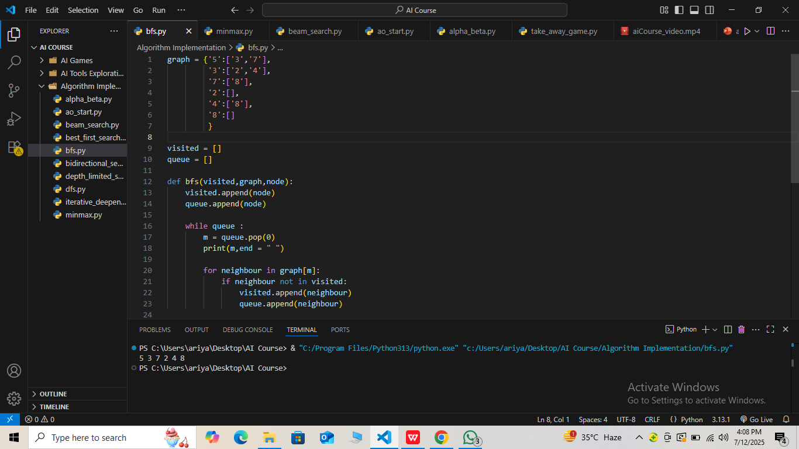
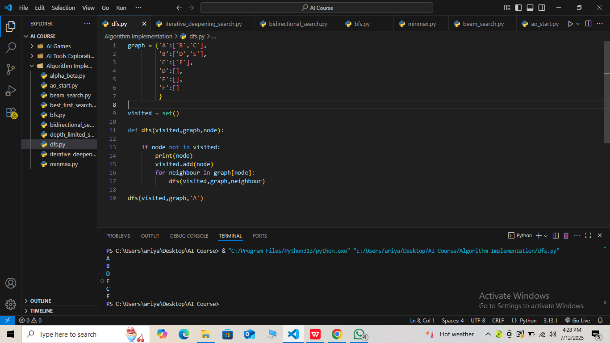
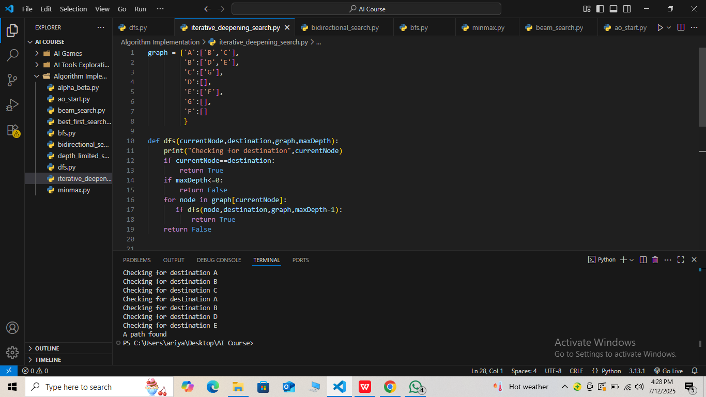
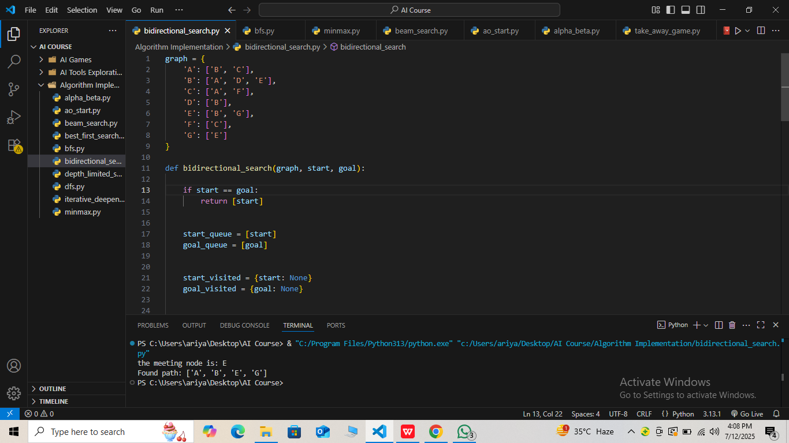
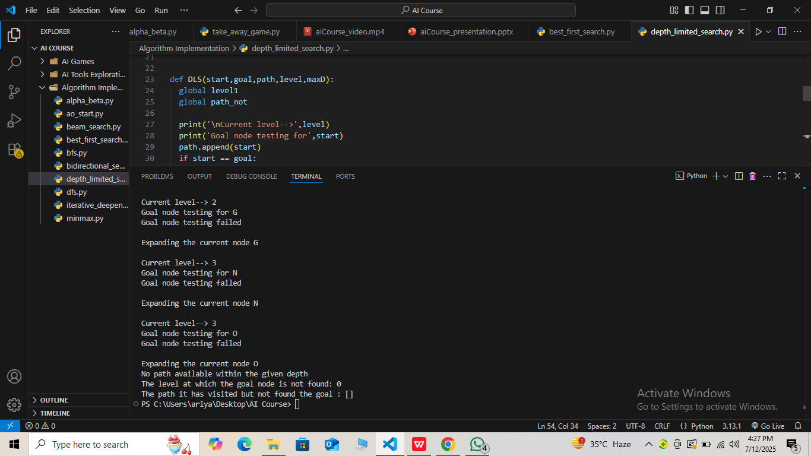
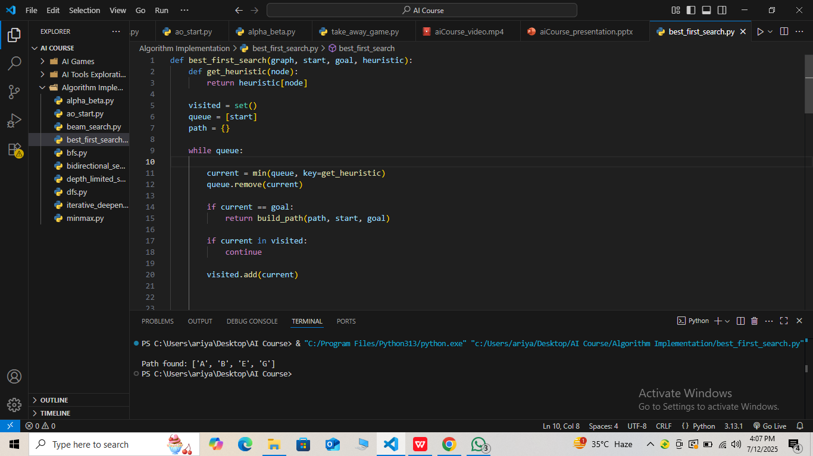
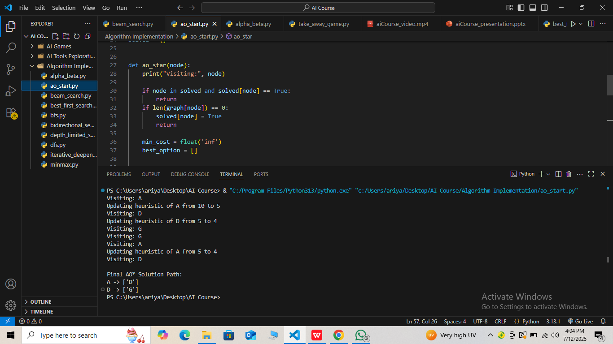
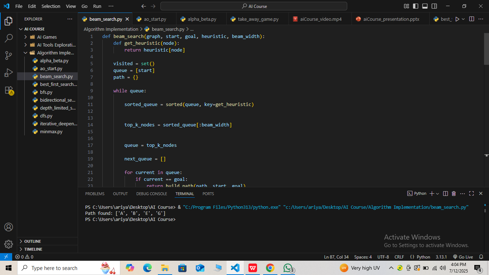
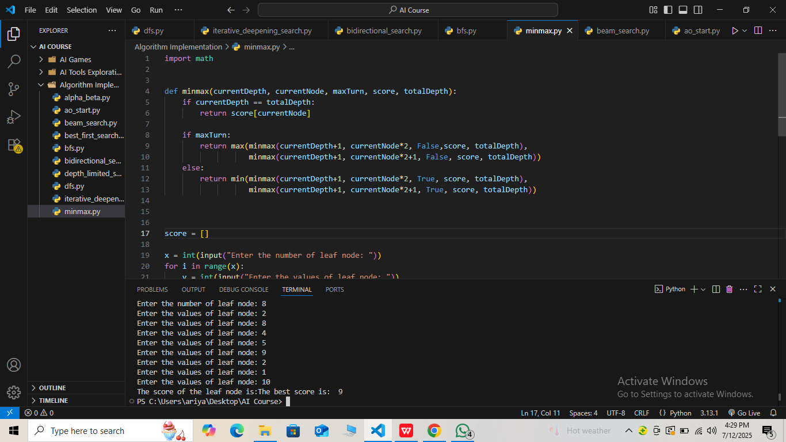
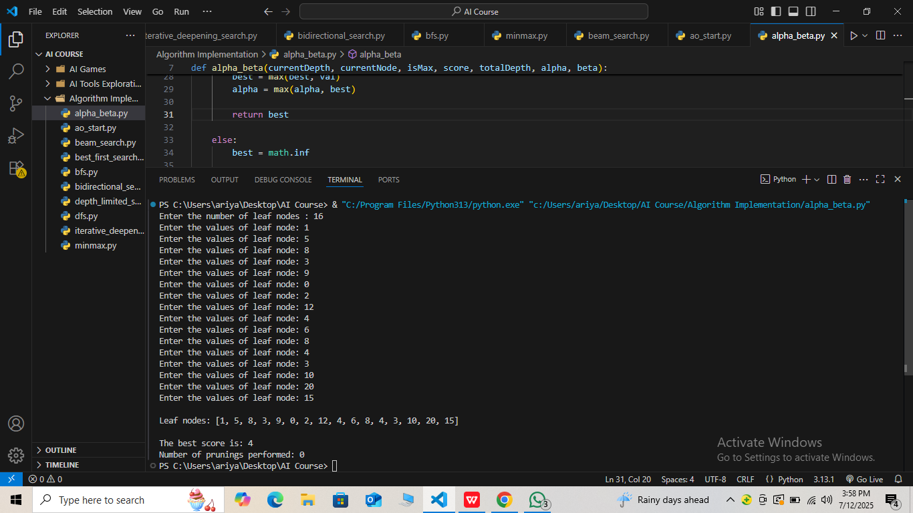

# Algorithm Implementation

This folder contains implementations of various AI algorithms covered in the course.

---

## Algorithms Included

- **Breadth-First Search (BFS)**  
  Explores nodes level by level using a queue.  
  Applications: shortest path, graph traversal.  
  Complexity:  
  - Time: O(b^d) where b is branching factor, d is depth of solution  
  - Space: O(b^d), can be memory heavy as it stores all nodes at each level

- **Depth-First Search (DFS)**  
  Explores nodes deeply before backtracking using recursion or a stack.  
  Applications: cycle detection, pathfinding.  
  Complexity:  
  - Time: O(b^m) where m is max depth of the tree  
  - Space: O(bm), much less memory than BFS

- **Iterative Deepening Search**  
  Runs DFS repeatedly with increasing depth limits.  
  Combines benefits of DFS and BFS, more memory efficient and complete.  
  Complexity:  
  - Time: O(b^d), slightly more than BFS due to repeated searches  
  - Space: O(bd)

- **Bidirectional Search**  
  Searches simultaneously from start and goal to meet in the middle.  
  Often much faster than regular search.  
  Complexity:  
  - Time: O(b^(d/2)), significantly faster than BFS  
  - Space: O(b^(d/2))

- **Depth-Limited Search**  
  DFS with a max depth limit to avoid infinite loops or very deep paths.  
  Complexity:  
  - Time: O(b^l) where l is the depth limit  
  - Space: O(bl)

- **Best-First Search**  
  Selects the most promising node based on heuristic scores.  
  Complexity similar to heuristic search.

- **AO* Algorithm**  
  Searches AND-OR graphs for problem decomposition, useful in complex tasks.  
  Complexity varies widely depending on graph size and structure.

- **Beam Search**  
  Keeps only the best few candidate nodes (beam width k) at each step, saving memory and time.  
  Complexity:  
  - Time: O(k * d), where d is depth and k is beam width  
  - Space: O(k)

- **Minimax Algorithm**  
  Recursive decision-making algorithm for two-player games exploring all possible moves.  
  Complexity:  
  - Time: O(b^m), b = branching factor, m = max depth  
  - Space: O(bm)

- **Alpha-Beta Pruning**  
  Optimizes Minimax by pruning branches that won’t affect outcome.  
  Complexity:  
  - Time: O(b^(m/2)) in best case (almost square root of Minimax)  
  - Space: O(bm)

---

## Applications

These algorithms are widely used in:

- Game AI development (e.g., Tic Tac Toe, Connect Four)  
- Pathfinding and navigation tasks  
- Natural Language Processing  
- Robotics and automated decision making  
- Puzzle solving and problem solving  

---

## Sample Input & Output (Screenshots)

Below are screenshots demonstrating the input/output behavior of each implemented algorithm:

### Breadth-First Search (BFS)

---

### Depth-First Search (DFS)

---

### Iterative Deepening Search (IDS)

---

### Bidirectional Search

---

### Depth-Limited Search

---

### Best-First Search

---

### AO* Algorithm

---

### Beam Search

---

### Minimax Algorithm

---

### Alpha-Beta Pruning

---

